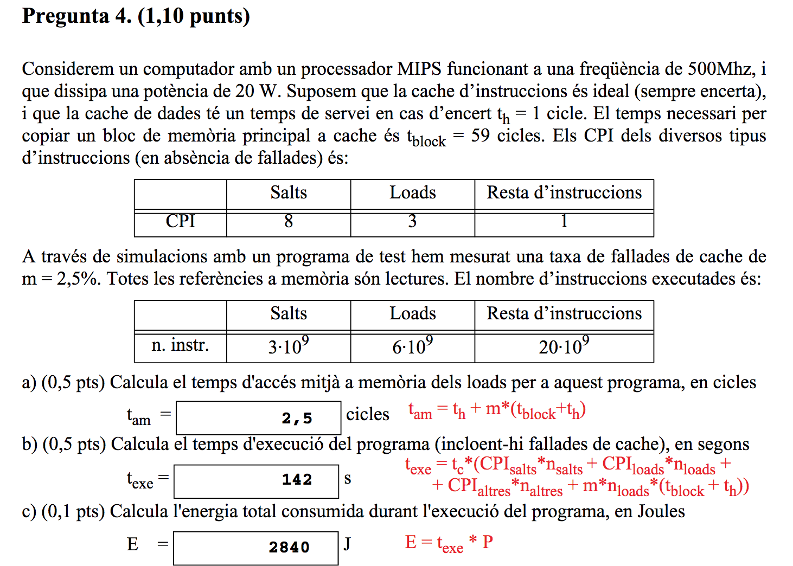
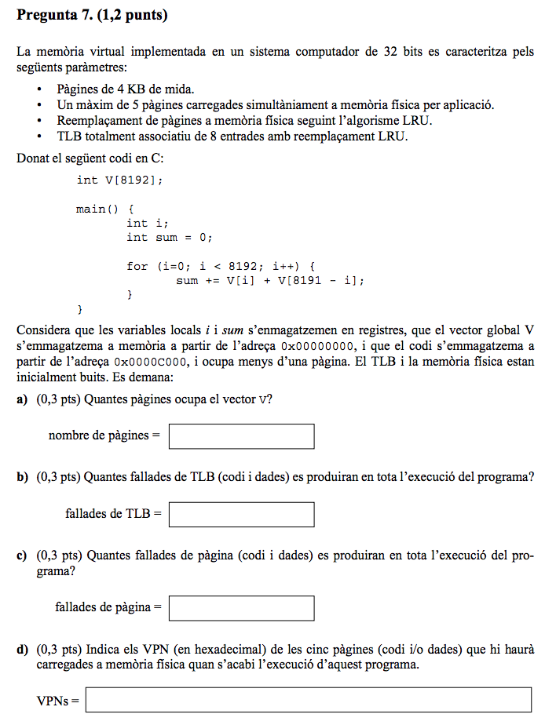
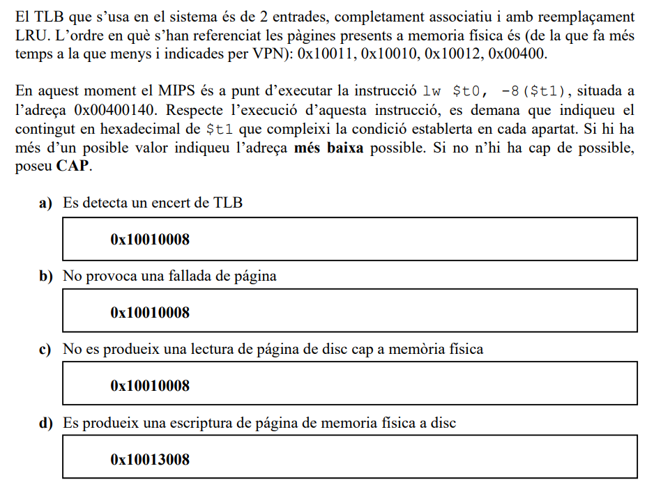

# EC: Estructura de Computadors (material professor R. Tous)

## Preguntes famoses d'antics examens 

Per minimitzar el nombre d'emails que rebo (especialment els dies anteriors a l'examen final) intento donar resposta aquí als dubtes que rebo sobre preguntes d'antics exàmens. 

## Pregunta 4 final 17-18/Q1

Para el cálculo del tiempo de acceso medio de los loads = 1 + 0,025 * 60 = 2.5

Para el cálculo de texe empezamos calculando el total de ciclos con MC ideal:

	Total cicles si MC ideal = (8*3+3*6+1*20)*10^9 = 62*10^9 cicles

Ahora calculamos los ciclos de penalización. Aquí distingue entre MC de instrucciones y datos pero podemos ignorar la MC de instrucciones ya que dice que siempre acierta. El total de ciclos de penalización será m * número de loads * penalización:

	Total cicles penalització = 0,025 * 6 * 10^9 * (59+1) = 9*10^9

	Texe = (62+9) * 10^9 * 2 * 10^-9 = 142 s

## Pregunta 7 final 18-19/Q1

Aquí la clau és que cal considerar que el codi només produeix una fallada de TLB i una de pàgina al principi, i ocuparà (durant tota l'execució) una entrada al TLB i una de les 5 pàgines disponibles. A partir d'aquí un es pot oblidar del codi i fer l'exercici simplement tenint en compte que tens menys entrades i pàgines disponibles:

	TLB (iteracions i VPNs accedides i M/H = miss/hit)

	i=0    .. i=1023 : 0(M), 7(M)
	i=1024 .. i=2047 : 1(M), 6(M)
	i=2048 .. i=3071 : 2(M), 5(M)
	i=3072 .. i=4095 : 3(M), 4(M) (aquí es reemplaça la 0 ja que al TLB només hi podem posar 7 pàgines de dades doncs 1 és pel codi)
	i=4096 .. i=5119 : 4(H), 3(H)
	i=5120 .. i=6143 : 5(H), 2(H)
	i=6144 .. i=7167 : 6(H), 1(H)
	i=7168 .. i=8191 : 7(H), 0(M) (aquí torna a fallar la 0 ja que va ser reemplaçada)

Fallades: 9 de dades  + 1 de codi = 10 fallades de TLB

TP

	i=0    .. i=1023 : 0(M), 7(M)
	i=1024 .. i=2047 : 1(M), 6(M)
	i=2048 .. i=3071 : 2(M), 5(M) reemplacem la 0 i la 7 (només hi ha 4 pàgines disponibles)
	i=3072 .. i=4095 : 3(M), 4(M) reemplacem la 1 i la 6
	i=4096 .. i=5119 : 4(H), 3(H) 
	i=5120 .. i=6143 : 5(H), 2(H)
	i=6144 .. i=7167 : 6(M), 1(M) reemplacem la 4 i la 3
	i=7168 .. i=8191 : 7(M), 0(M) reemplacem la 5 i la 2

Fallades: 12 + 1 de codi = 13

## Pregunta 5 final 19-20/Q1

	Total cicles si MC ideal = 3*10^9 * CPIideal
	Total cicles penalització = 0,1 * 2*10^9 * (199+1)  = 40*10^9 cicles
	Texe = (total cicles si MC ideal + total cicles penalització) * tc
	Texe = (3*CPIideal+40)*10^9*1*10^-9 = 3*CPIideal+40
	No dicen que Texe = 52
	3*CPIideal+40 = 52
	CPIideal = 4

## Pregunta 5 final 20-21/Q1

Aquesta és potser la pregunta més famosa de totes. Potser es podria haver redactat millor. Com diu que "és a punt d'executar la instrucció" l'accés a memòria que cal considerar és el fetch de la instrucció que està a la pàgina 0x00400 (que està al TLB i a la MF). Sigui quin sigui el contingut de $t1 el fetch no produirà miss de TLB ni fallada de pàgina. Però com diu l'adreça "més baixa possible" de $t1 doncs agafem 0x10010008. 

## Pregunta 7 final 20-21/Q1

Aquí la polèmica va ser la solució oficial de l'apartat (d), que era errònea:

L'explicació de l'apartat (a) seria:

	MCdades = 512KB = 2^19 = 2^10 conj * 2^2 vies * 2^5 words * 2^2 bytes/word

	bits offset = 7 bits
	bits #conjunt = 10 bits
	etiqueta = 32 - 10 - 7 = 15 bits

L'explicació dels apartats (b) i (c) seria:

	penalització accés instrució =tp_i= tbloc + thit = 18 + 2 = 20 cicles
	penalització accés a dades = tp_d = (1-pm) *  (tbloc + thit) + pm * (2tbloc + thit) = 2/3 * 20 + 1/3 * 38 = 26 cicles

	b) penalització fetch = 0,05 * tp_i = 0,05 * 20 = 1
	c) penalització lectura/escriptura dada = 0,15 * 0,3 * tp_d = 0,15 * 0,3 * 26 = 1,17 = 1,2

La solució correcta de l'apartat (d) seria:

	d) CPI = CPIideal + penalització fetch + penalització dades = 2,5 + 1 + 1,2 = 4,7 cicles

## Pregunta 8 final 21-22/Q1

- Una pàgina son 2KB=2^11=2048 bytes=512 words
- El vector ocupa 4096 words, és a dir 8 pàgines
- Com comença a l'adreça 0x0 les VPNs del vector són 0, 1, 2, 3, 4, 5, 6 i 7
- El codi ocupa una pàgina, com comença a la 0x00004000, si treus 11 bits d'offset queda VPN = 0x8
- El codi només produeix una fallada de TLB i una de pàgina al principi, i ocuparà (durant tota l'execució) una de les 16 entrades del TLB i una de les 5 pàgines disponibles de MF. A partir d'aquí un es pot oblidar del codi i fer l'exercici simplement tenint en compte que tens només 15 entrades de TLB i 4 pàgines de MF disponibles:

TP (iteracions, VPNs accedides i M=fallada de pàgina, H=encert)

	i=0    .. i=511 : 0(M), 7(M)
	i=512  .. i=1023: 1(M), 6(M)
	i=1024 .. i=1511: 2(M), 5(M) reemplacem la 0 i la 7
	i=1512 .. i=2047: 3(M), 4(M) reemplacem la 1 i la 6
	i=2048 .. i=2559: 4(H), 3(H)
	i=2560 .. i=3071: 5(H), 2(H)
	i=3072 .. i=3583: 6(M), 1(M) reemplacem la 3 i la 4
	i=3584 .. i=4096: 7(M), 0(M) reemplacem la 2 i la 5

12 fallades + 1 fallada del codi = 13 fallades de pàgina

TLB

Com el TLB és gran (16 entrades de les quals 1 pel codi) no hi hauran reemplaçaments i simplement tindrem 8 miss + 1 del codi = 9 miss.

Les darreres VPN accedides són el codi (0x8) i les VPNs de dades 0x6, 0x1, 0x7 i 0x0.

<!--## Pregunta 11 final 20-21/Q2-->

## Pregunta 5 final 22-23/Q1

Aquí la polèmica va ser la solució del valor de "e" a l'apartat (b). La solució publicada era errònea, la correcta seria 0x0789.

