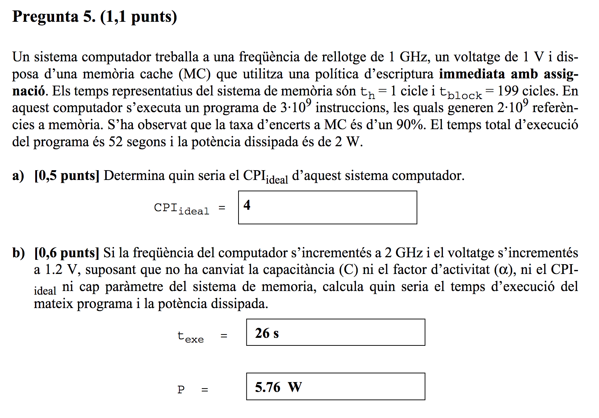
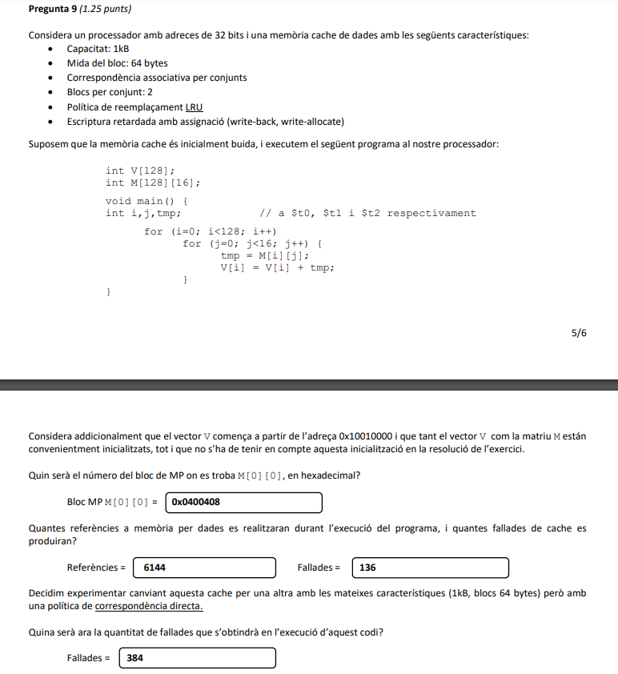
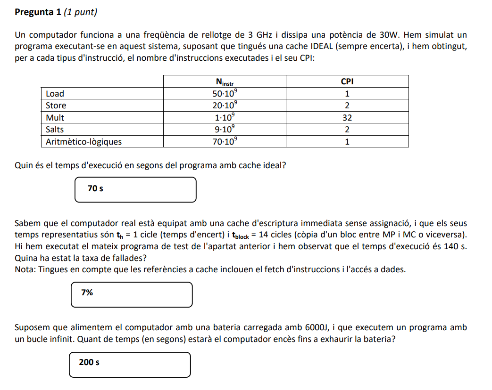

# EC: Estructura de Computadors (material professor R. Tous)

## EC Hall of Fame (Preguntes famoses d'antics examens)

Per minimitzar el nombre d'emails que rebo (especialment els dies anteriors a l'examen final) intento donar resposta aquí als dubtes més freqüents sobre preguntes d'antics exàmens. No són preguntes massa representatives, n'hi ha de molt difícils, algunes amb enunciats no gaire afortunats i algunes amb errors a la solució oficial.

## Pregunta 4 final 17-18/Q1

Para el cálculo del tiempo de acceso medio de los loads = 1 + 0,025 * 60 = 2.5

Para el cálculo de texe empezamos calculando el total de ciclos con MC ideal:

	Total cicles si MC ideal = (8*3+3*6+1*20)*10^9 = 62*10^9 cicles

Ahora calculamos los ciclos de penalización. Aquí distingue entre MC de instrucciones y datos pero podemos ignorar la MC de instrucciones ya que dice que siempre acierta. El total de ciclos de penalización será m * número de loads * penalización:

	Total cicles penalització = 0,025 * 6 * 10^9 * (59+1) = 9*10^9

	Texe = (62+9) * 10^9 * 2 * 10^-9 = 142 s

## Pregunta 7 final 18-19/Q1

Aquí la clau és que cal considerar que el codi només produeix una fallada de TLB i una de pàgina al principi, i ocuparà (durant tota l'execució) una entrada al TLB i una de les 5 pàgines disponibles. A partir d'aquí un es pot oblidar del codi i fer l'exercici simplement tenint en compte que tens menys entrades i pàgines disponibles:

	TLB (iteracions i VPNs accedides i M/H = miss/hit)

	i=0    .. i=1023 : 0(M), 7(M)
	i=1024 .. i=2047 : 1(M), 6(M)
	i=2048 .. i=3071 : 2(M), 5(M)
	i=3072 .. i=4095 : 3(M), 4(M) (aquí es reemplaça la 0 ja que al TLB només hi podem posar 7 pàgines de dades doncs 1 és pel codi)
	i=4096 .. i=5119 : 4(H), 3(H)
	i=5120 .. i=6143 : 5(H), 2(H)
	i=6144 .. i=7167 : 6(H), 1(H)
	i=7168 .. i=8191 : 7(H), 0(M) (aquí torna a fallar la 0 ja que va ser reemplaçada)

Fallades: 9 de dades  + 1 de codi = 10 fallades de TLB

TP

	i=0    .. i=1023 : 0(M), 7(M)
	i=1024 .. i=2047 : 1(M), 6(M)
	i=2048 .. i=3071 : 2(M), 5(M) reemplacem la 0 i la 7 (només hi ha 4 pàgines disponibles)
	i=3072 .. i=4095 : 3(M), 4(M) reemplacem la 1 i la 6
	i=4096 .. i=5119 : 4(H), 3(H) 
	i=5120 .. i=6143 : 5(H), 2(H)
	i=6144 .. i=7167 : 6(M), 1(M) reemplacem la 4 i la 3
	i=7168 .. i=8191 : 7(M), 0(M) reemplacem la 5 i la 2

Fallades: 12 + 1 de codi = 13

## Pregunta 5 final 19-20/Q1

	Total cicles si MC ideal = 3*10^9 * CPIideal
	Total cicles penalització = 0,1 * 2*10^9 * (199+1)  = 40*10^9 cicles
	Texe = (total cicles si MC ideal + total cicles penalització) * tc
	Texe = (3*CPIideal+40)*10^9*1*10^-9 = 3*CPIideal+40
	Ens diuen que Texe = 52
	3*CPIideal+40 = 52
	CPIideal = 4

## Pregunta 5 final 20-21/Q1

Aquesta és potser la pregunta més famosa de totes. Potser es podria haver redactat millor. Com diu que "és a punt d'executar la instrucció" l'accés a memòria que cal considerar és el fetch de la instrucció que està a la pàgina 0x00400 (que està al TLB i a la MF). Sigui quin sigui el contingut de $t1 el fetch no produirà miss de TLB ni fallada de pàgina. Però com diu l'adreça "més baixa possible" de $t1 doncs agafem 0x10010008. 

## Pregunta 7 final 20-21/Q1

Aquí la polèmica va ser la solució oficial de l'apartat (d), que era errònea:

L'explicació de l'apartat (a) seria:

	MCdades = 512KB = 2^19 = 2^10 conj * 2^2 vies * 2^5 words * 2^2 bytes/word

	bits offset = 7 bits
	bits #conjunt = 10 bits
	etiqueta = 32 - 10 - 7 = 15 bits

L'explicació dels apartats (b) i (c) seria:

	penalització accés instrució =tp_i= tbloc + thit = 18 + 2 = 20 cicles
	penalització accés a dades = tp_d = (1-pm) *  (tbloc + thit) + pm * (2tbloc + thit) = 2/3 * 20 + 1/3 * 38 = 26 cicles

	b) penalització fetch = 0,05 * tp_i = 0,05 * 20 = 1
	c) penalització lectura/escriptura dada = 0,15 * 0,3 * tp_d = 0,15 * 0,3 * 26 = 1,17 = 1,2

La solució correcta de l'apartat (d) seria:

	d) CPI = CPIideal + penalització fetch + penalització dades = 2,5 + 1 + 1,2 = 4,7 cicles

## Pregunta 9 final 20-21/Q2

Un dels exercicis de memòria cache més difícils que recordo:

Anàlisi geometria MC

	MC = 1KB = 1024 
	= 2^10 = 2^3 conjunts * 2^1 vies * 2^4 words * 2^2 bytes/words 
	= 8 conjunts de 16 paraules

offset = 6 bits

Anàlisi estructures:

Vector:

int V[128]: 128/16 = 8 blocs, per tant la següent estructura comença al conjunt 0. L'adreça del primer bloc MP serà (treient els 6 bits d'offset)

En binari:

	0001 0000 0000 0001 0000 0000 00
	=  
	00 0100 0000 0000 0100 0000 0000

	= 

	0x400400

Matriu:

int M[128][16]: un bloc cada filera.

Bloc MP de M[0][0]? 0x400408 

Anàlisi del codi (2 vies):

En algunes iteracions el bloc de V i de M van a parar al mateix conjunt però no importa ja que tenim 2 vies. Per tant simplement tindrem una fallada per bloc:

	V = 8 blocs = 8 fallades
	M = 128 blocs = 128 fallades
	Total: 136 fallades

Correspondència directa (el difícil):

Revisem la geometria de la MC i el mapeig de les estructures:

- Ara tindrem 16 línies en comptes de 8 conjunts de 2 vies. 
- V es mapejarà a 8 primeres.
- Les fileres 0..7 de M es mapejaran a les línies 8-15.
- Les fileres 8..15 de M es mapejaran a les línies 0-7, igual que V.
- Cada 8 fileres de M tornaran a coincidir M i V. Això passarà 8 vegades.

Anàlisi del codi 

Iteracions 0..7 bucle exterior (i):

	i=0, j=0..15: M[0][0..15]:línia 8,  V[0]:línia 0 -> 2 fallades
	i=1, j=0..15: M[1][0..15]:línia 9,  V[1]:línia 0 -> 1 fallades 
	i=2, j=0..15: M[2][0..15]:línia 10, V[2]:línia 0 -> 1 fallades 
	...
	i=7, j=0..15: M[7][0..15]:línia 15, V[7]:línia 0 -> 1 fallades 

2+7 = 9 fallades

Iteracions 8..15 bucle exterior (i):

	i=8,  j=0..15: M[8][0..15]: línia 0, V[8]: línia 0 -> 16 * 2 fallades
	i=9,  j=0..15: M[9][0..15]: línia 1, V[9]: línia 0 -> 1 fallades 
	i=10, j=0..15: M[10][0..15]:línia 2, V[10]:línia 0 -> 1 fallades 
	...
	i=15, j=0..15: M[15][0..15]:línia 7, V[15]:línia 0 -> 1 fallades 

16*2+7 = 39 fallades

Aquest esquema es repetirà 8 vegades:

(9+39)*8 = 384 fallades

## Pregunta 8 final 21-22/Q1

- Una pàgina son 2KB=2^11=2048 bytes=512 words
- El vector ocupa 4096 words, és a dir 8 pàgines
- Com comença a l'adreça 0x0 les VPNs del vector són 0, 1, 2, 3, 4, 5, 6 i 7
- El codi ocupa una pàgina, com comença a la 0x00004000, si treus 11 bits d'offset queda VPN = 0x8
- El codi només produeix una fallada de TLB i una de pàgina al principi, i ocuparà (durant tota l'execució) una de les 16 entrades del TLB i una de les 5 pàgines disponibles de MF. A partir d'aquí un es pot oblidar del codi i fer l'exercici simplement tenint en compte que tens només 15 entrades de TLB i 4 pàgines de MF disponibles:

TP (iteracions, VPNs accedides i M=fallada de pàgina, H=encert)

	i=0    .. i=511 : 0(M), 7(M)
	i=512  .. i=1023: 1(M), 6(M)
	i=1024 .. i=1511: 2(M), 5(M) reemplacem la 0 i la 7
	i=1512 .. i=2047: 3(M), 4(M) reemplacem la 1 i la 6
	i=2048 .. i=2559: 4(H), 3(H)
	i=2560 .. i=3071: 5(H), 2(H)
	i=3072 .. i=3583: 6(M), 1(M) reemplacem la 3 i la 4
	i=3584 .. i=4096: 7(M), 0(M) reemplacem la 2 i la 5

12 fallades + 1 fallada del codi = 13 fallades de pàgina

TLB

Com el TLB és gran (16 entrades de les quals 1 pel codi) no hi hauran reemplaçaments i simplement tindrem 8 miss + 1 del codi = 9 miss.

Les darreres VPN accedides són el codi (0x8) i les VPNs de dades 0x6, 0x1, 0x7 i 0x0.

<!--## Pregunta 11 final 20-21/Q2-->

## Pregunta 5 final 22-23/Q1

Aquí la polèmica va ser la solució del valor de "e" a l'apartat (b). La solució publicada era errònea, la correcta seria 0x0789.

## Pregunta 1 ?????

a)

	total_cicles_ideal = (1*50+2*20+32*1+2*9+1*70)*10^9 =  210*10^9 cicles
	texe = total_cicles_ideal * tc
	texe = 210*10^9 * 1/3*10^-9 = 70s

b)

	texe = 140 = total_cicles * tc
	total_cicles = 140/tc = 140*3*10^9 = 420*10^9 cicles
	total_cicles_penalitzacio = total_cicles - total_cicles_ideal = 420*10^9 - 210*10^9 = 210 *10^9
	total_cicles_penalitzacio = 210 *10^9 = (#instr+#loads) * m * (tbloc + th) = (150+50)*10^9 * m * 15
	210*10^9 = 200*10^9 * m * 15
	m = 210*10^9/(200*10^9*15) = 0,07 = 7%

c)

	t = 6000/30 = 200 s

## Pregunta 7 parcial 24-25/Q2

Calia traduir aquest codi:
'''
void subr(short M[][100], int j) {
	int i;
	for (i=1; i<=j; i+=2)
		M[i-1][i]=M[i][i+2]-M[i+1][i-1];
}
'''

Omplint les caixetes aquí (entre [] les solucions):

	subr: addiu $t0, $a0, [206] #@primer element recorregut
		  li $t2, [202]
		  mult $a1, $t2
		  mflo $t3
		  subu $t4, $t3, $t2
		  addu $t1, $t0, $t4 #@ultim element dintre del recorregut
		  addu $t2, $t2, $t2
		  b test
	loop: lh $t5, 0($t0)   #M[i][i+2]
		  lh $t6, [194] ($t0)
		  subu $t7, $t5, $t6
		  sh $t7, [-204] ($t0)
		  addu $t0, $t0, $t2
	test: [bleu] $t0, $t1, loop
		  jr $ra
Analitzem algunes iteracions:

	i=1 M[0][1]=M[1][3]-M[2][1];
	i=3 M[2][3]=M[3][5]-M[4][2];
	i=5 M[4][5]=M[5][7]-M[6][4];
	...
Son tres diagonals que avancen en paral·lel. Podrem fer servir un únic punter a una de les diagonals i per accedir a les altres simplement utilitzarem l'offset del lh/sh. Al codi es veu que $t0 és el punter (apareix als lh/sh). Es pot deduir que és un punter a &M[i][i+2], però a part hi ha un comentari a la línia 9 que ho diu explícitament. Sabent això podem calcular la inicialització (línia 1):

	&M[1][1+2] = M + (1*100+3)*2 = M + 206

Ara podem calcular l'stride ($t2):

	stride (en elements) = &M[i][i+2] amb i incrementada - &M[i][i+2]
						 = &M[(i+2)][(i+2)+2] - &M[i][i+2]
						 = M+100i+200+i+4 - (M+100i+i+2)
		                 = 202	              
			en bytes     = 202*2 = 404	 

Però fixeu-vos que a la línia 7 fa addu $t2, $t2, $t2! per lo que el valor inicial de $t2 ha de ser la meitat (primera trampa d'aquest exercici):

			li $t2, 202

Ara calculem l'offset de la línia 10 (lh $t6, [194]). Com és un load sabem que és M[i+1][i-1]:

	offset (en elements) entre &M[i+1][i-1] i &M[i][i+2]:
						= &M[i+1][i-1] - (&M[i][i+2])
						= M+100i+100+i-1 - (M+100i+i+2)
						= 97
			en bytes	= 97*2 = 194

L'offset de la línia 12 (sh $t7, [-204]). El de M[i-1][i]:

	offset (en elements) entre &M[i-1][i] i &M[i][i+2]:
						= &M[i-1][i] - (&M[i][i+2])
						= M+100i-100+i - (M+100i+i+2)
						= -102
			en bytes	= -102*2 = -204

La instrucció de salt és un [bleu] ja que la condició és i<=j (bl) i estem comparant adreces (u). 

El càlcul de l'últim element del recorregut (a $t1) és embolicat i tot i que no hi havia caixetes a omplir complica la comprensió del codi. El que fa és:

	Últim element quan i==j: &M[j][j+2] = (M+101j+2)*2 = M+202j+4 

	Obtinc primer 202j a $t3:
	li $t2, 202
	mult $a1, $t2
	mflo $t3

	I aquí vé la pirueta de l'exercici. En comptes de simplement sumar-li 4 i després M, el que fa és restar-li 202 i després sumar-li $t0 (primer element del recorregut) que val M+206. 

	subu $t4, $t3, $t2 #$t4 = 202j-202
	addu $t1, $t0, $t4 #$t1 = 202j-202+M+206 = M+202j+4

		  
		  

	M[i-1][i]=M[i][i+2]-M[i+1][i-1];

