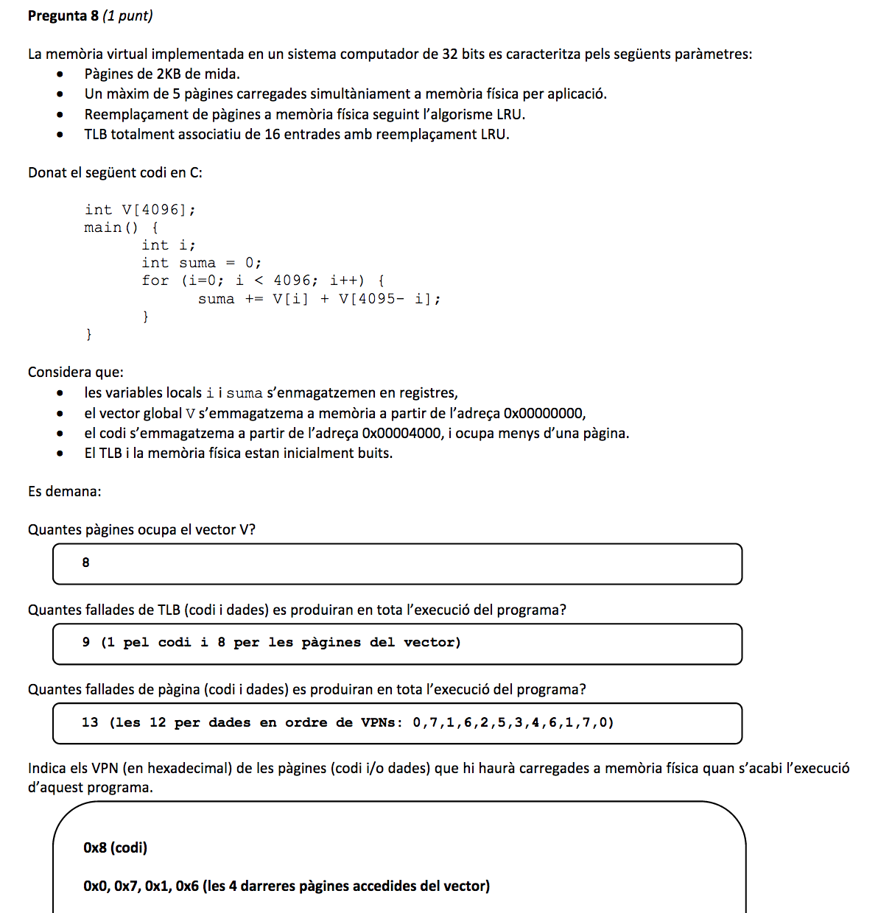
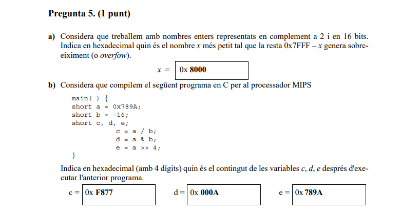
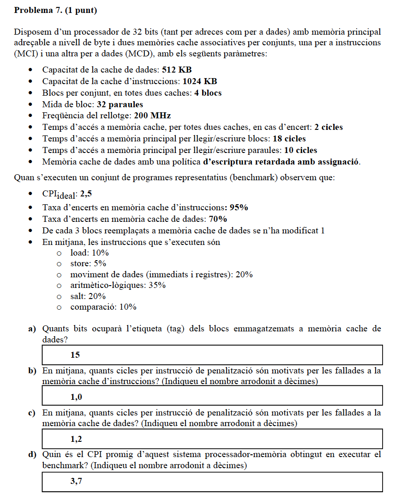

# EC: Estructura de Computadors (material professor R. Tous)

## Preguntes famoses d'antics examens 

Per minimitzar el nombre d'emails que rebo (especialment els dies anteriors a l'examen final) intento donar resposta aquí als dubtes que rebo sobre preguntes d'antics exàmens. 

## Pregunta 8 final 21-22/Q1

- Una pàgina son 2KB=2^11=2048 bytes=512 words
- El vector ocupa 4096 words, és a dir 8 pàgines
- Com comença a l'adreça 0x0 les VPNs del vector són 0, 1, 2, 3, 4, 5, 6 i 7
- El codi ocupa una pàgina, com comença a la 0x00004000, si treus 11 bits d'offset queda VPN = 0x8
- El codi només produeix una fallada de TLB i una de pàgina al principi, i ocuparà (durant tota l'execució) una de les 16 entrades del TLB i una de les 5 pàgines disponibles de MF. A partir d'aquí un es pot oblidar del codi i fer l'exercici simplement tenint en compte que tens només 15 entrades de TLB i 4 pàgines de MF disponibles:

TP (iteracions, VPNs accedides i M=fallada de pàgina, H=encert)

	i=0       .. i=511  : 0(M), 7(M)
	i=512   .. i=1023: 1(M), 6(M)
	i=1024 .. i=1511: 2(M), 5(M) reemplacem la 0 i la 7
	i=1512 .. i=2047: 3(M), 4(M) reemplacem la 1 i la 6
	i=2048 .. i=2559: 4(H), 3(H)
	i=2560 .. i=3071: 5(H), 2(H)
	i=3072 .. i=3583: 6(M), 1(M) reemplacem la 3 i la 4
	i=3584 .. i=4096: 7(M), 0(M) reemplacem la 2 i la 5

12 fallades + 1 fallada del codi = 13 fallades de pàgina

TLB

Com el TLB és gran (16 entrades de les quals 1 pel codi) no hi hauran reemplaçaments i simplement tindrem 8 miss + 1 del codi = 9 miss.

Les darreres VPN accedides són el codi (0x8) i les VPNs de dades 0x6, 0x1, 0x7 i 0x0.

## Pregunta 11 final 20-21/Q2

## Pregunta 5 final 22-23/Q1

Aquí la polèmica va ser la solució del valor de "e" a l'apartat (b). La solució publicada era errònea, la correcta seria 0x0789.

## Pregunta 7 final 20-21/Q1

Aquí la polèmica va ser la solució oficial de l'apartat (d), que era errònea:

L'explicació dels apartats (b) i (c) seria:

	penalització accés instrució =tp_i= tbloc + thit = 18 + 2 = 20 cicles
	penalització accés a dades = tp_d = (1-pm) *  (tbloc + thit) + pm * (2tbloc + thit) = 2/3 * 20 + 1/3 * 38 = 26 cicles

	b) penalització fetch = 0,05 * tp_i = 0,05 * 20 = 1
	c) penalització lectura/escriptura dada = 0,15 * 0,3 * tp_d = 0,15 * 0,3 * 26 = 1,17 = 1,2

La solució correcta de l'apartat (d) seria:

	d) CPI = CPIideal + penalització fetch + penalització dades = 2,5 + 1 + 1,2 = 4,7 cicles

