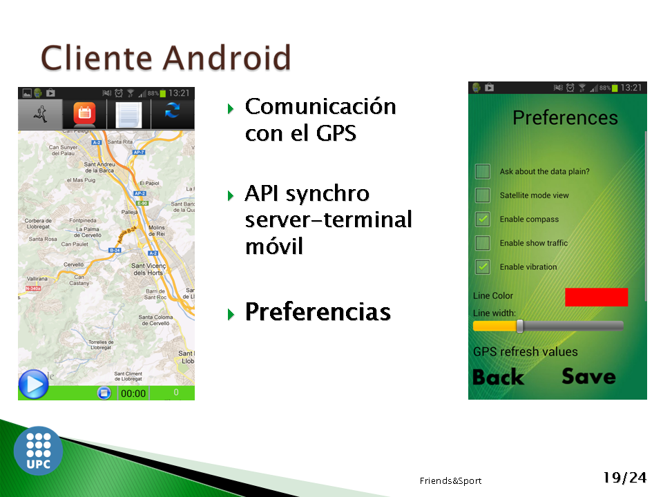

## Contents

* [1 Proyecto FriendsAndSport](#Proyecto_FriendsAndSport)
  + [1.1 1. Resumen de la propuesta](#1._Resumen_de_la_propuesta)
  + [1.2 2. Tecnologias](#2._Tecnologias)
    - [1.2.1 Servidor](#Servidor)
    - [1.2.2 Android](#Android)
    - [1.2.3 Web](#Web)
  + [1.3 3. Screenshots](#3._Screenshots)
    - [1.3.1 Web](#Web_2)
    - [1.3.2 Cliente Android](#Cliente_Android)

# Proyecto FriendsAndSport[[edit](/pti/index.php?title=Categor%C3%ADa:FriendAndSport&veaction=edit&section=1 "Edit section: Proyecto FriendsAndSport") | [edit source](/pti/index.php?title=Categor%C3%ADa:FriendAndSport&action=edit&section=1 "Edit section: Proyecto FriendsAndSport")]

Nuestra objetivo es hacer una aplicación deportiva.

Nuestra proyecto consta de una parte web y otra parte para los terminales Android.

Los deportes soportados son: running, rollerblading y ciclismo.

## 1. Resumen de la propuesta[[edit](/pti/index.php?title=Categor%C3%ADa:FriendAndSport&veaction=edit&section=2 "Edit section: 1. Resumen de la propuesta") | [edit source](/pti/index.php?title=Categor%C3%ADa:FriendAndSport&action=edit&section=2 "Edit section: 1. Resumen de la propuesta")]

Nuestro proyecto es una aplicación, tanto web como para Android con la cual se podrá
hacer deporte a otro nivel. Constará de dos partes bien diferenciadas. La primera será una aplicación
web y la segunda será una aplicación Android

## 2. Tecnologias[[edit](/pti/index.php?title=Categor%C3%ADa:FriendAndSport&veaction=edit&section=3 "Edit section: 2. Tecnologias") | [edit source](/pti/index.php?title=Categor%C3%ADa:FriendAndSport&action=edit&section=3 "Edit section: 2. Tecnologias")]

### Servidor[[edit](/pti/index.php?title=Categor%C3%ADa:FriendAndSport&veaction=edit&section=4 "Edit section: Servidor") | [edit source](/pti/index.php?title=Categor%C3%ADa:FriendAndSport&action=edit&section=4 "Edit section: Servidor")]

* PHP 5.2
* Servidor Apache
* Base de datos MySQLi gestionada con un phpMyAdmin

### Android[[edit](/pti/index.php?title=Categor%C3%ADa:FriendAndSport&veaction=edit&section=5 "Edit section: Android") | [edit source](/pti/index.php?title=Categor%C3%ADa:FriendAndSport&action=edit&section=5 "Edit section: Android")]

* Diseño del cliente Android
* Comunicación con el GPS

### Web[[edit](/pti/index.php?title=Categor%C3%ADa:FriendAndSport&veaction=edit&section=6 "Edit section: Web") | [edit source](/pti/index.php?title=Categor%C3%ADa:FriendAndSport&action=edit&section=6 "Edit section: Web")]

* Patrón Model-View-Controller (MVC)
* Html para la capa de presentación
* JavaScript para la interacción entre el usuario y la aplicación.
* PHP para la implementación de la capa de modelo.
* módulo PHP para la ejecución de Sql.

## 3. Screenshots[[edit](/pti/index.php?title=Categor%C3%ADa:FriendAndSport&veaction=edit&section=7 "Edit section: 3. Screenshots") | [edit source](/pti/index.php?title=Categor%C3%ADa:FriendAndSport&action=edit&section=7 "Edit section: 3. Screenshots")]

### Web[[edit](/pti/index.php?title=Categor%C3%ADa:FriendAndSport&veaction=edit&section=8 "Edit section: Web") | [edit source](/pti/index.php?title=Categor%C3%ADa:FriendAndSport&action=edit&section=8 "Edit section: Web")]

### Cliente Android[[edit](/pti/index.php?title=Categor%C3%ADa:FriendAndSport&veaction=edit&section=9 "Edit section: Cliente Android") | [edit source](/pti/index.php?title=Categor%C3%ADa:FriendAndSport&action=edit&section=9 "Edit section: Cliente Android")]

