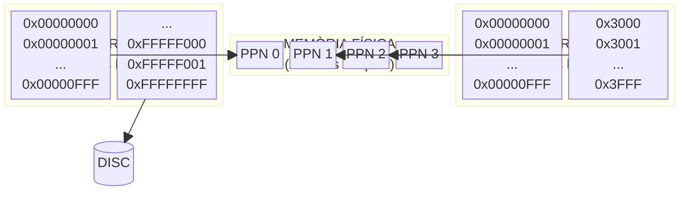
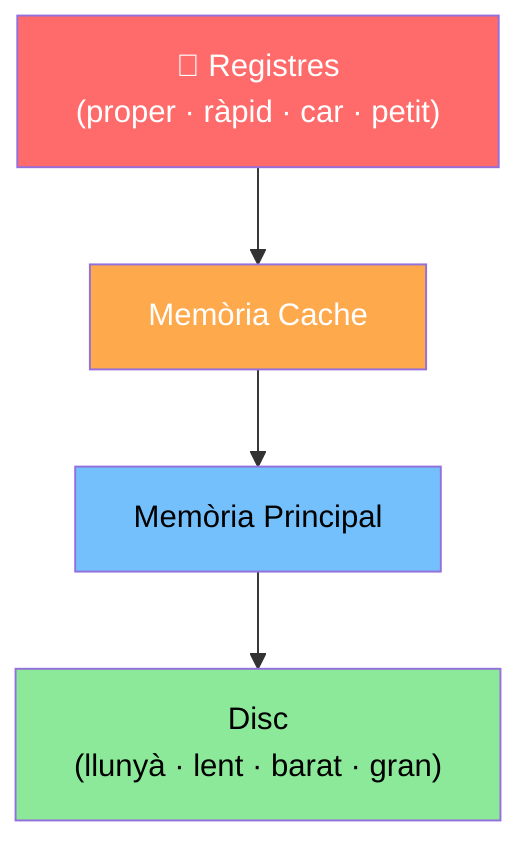
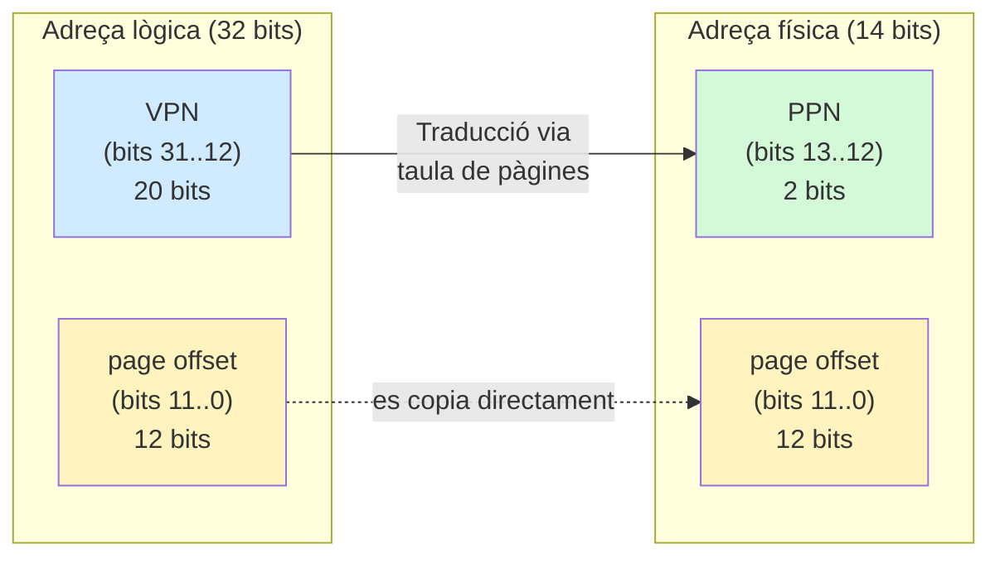
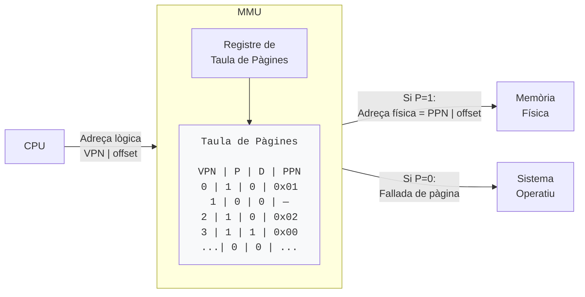
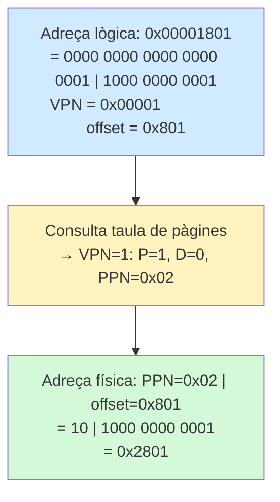
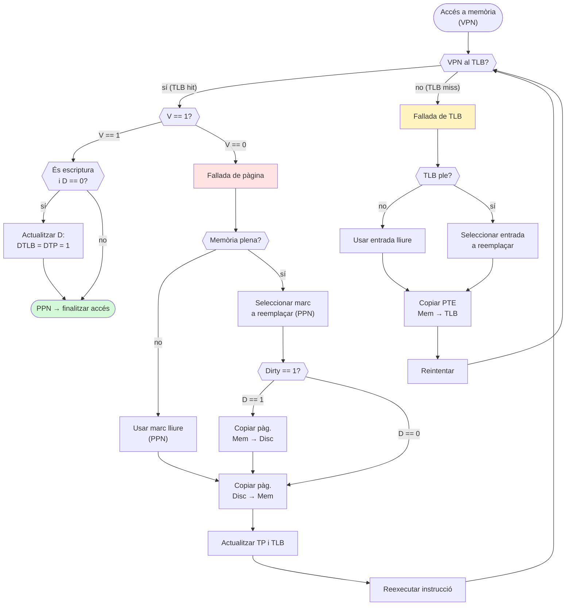
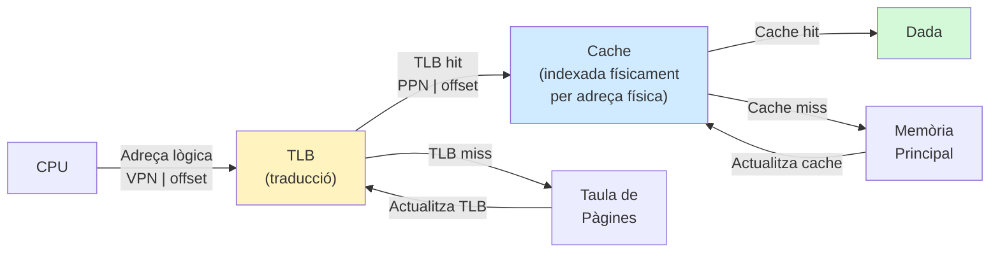
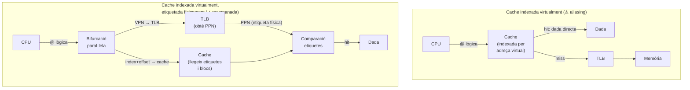
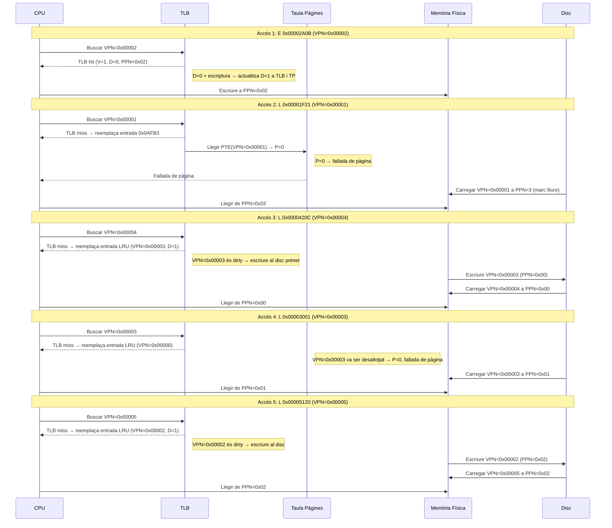

# Tema 7. Memòria Virtual

**Rubèn Tous · Joan Manuel Parcerisa · Jordi Tubella**  
Departament d'Arquitectura de Computadors — Facultat d'Informàtica de Barcelona  
Març 2018

---

## 1. Introducció

En el Tema 3, vam veure que durant els processos de compilació, assemblatge i enllaçat s'assignen adreces de memòria absolutes a les instruccions i les dades d'un programa. Però, si en un computador modern executem múltiples programes simultàniament, tots ells compartint la memòria, aquests programes s'haurien de reubicar en el moment d'executar-se per evitar conflictes. I, què ocorre si el conjunt d'instruccions i dades dels programes en execució supera la grandària de la memòria física del computador? En un principi ens impossibilitaria l'execució dels programes.

La solució la trobem en una tècnica que s'anomena **memòria virtual**. Per un costat, la memòria virtual permet que la memòria del computador sigui compartida per múltiples programes, implementant la reubicació dels programes a través d'un mecanisme de traducció d'adreces, i proporcionant mecanismes eficients i segurs de protecció i compartició entre ells. Per un altre costat, permet a un o més programes excedir la capacitat de la memòria principal, gràcies a l'ús de l'emmagatzematge secundari, ja sigui disc o SSD, com un nivell més en la jerarquia de memòria del computador.

### 1.1 Espai d'adreçament físic i espai d'adreçament lògic

La memòria virtual consisteix essencialment en fer servir dos espais d'adreçament diferents. Per un costat, les adreces que hi haurà als programes seran adreces d'un **espai d'adreçament lògic o virtual**. Aquest espai d'adreçament és exclusiu de cada programa, i la seva grandària és la màxima permesa pel número de bits d'adreça que faci servir el computador. Les adreces amb que treballarà la CPU seran adreces lògiques.

Per un altre costat, al conjunt d'adreces de la memòria física (les adreces "reals") l'anomenarem **espai d'adreçament físic**. La Unitat de Gestió de Memòria (MMU) "tradueix" l'adreça lògica per l'adreça física d'on realment es troba la dada.

**Figura 7.1.** Espais d'adreçament lògic de dos programes, espai d'adreçament físic (memòria física) i el disc.



### 1.2 El disc com un nivell més en la jerarquia de memòria

Una de les motivacions originals de la memòria virtual era donar solució al problema de no poder encabir tot un programa a la memòria física. Tradicionalment, això s'havia solucionat mitjançant la tècnica dels **overlays**, on el programador divideix el programa en blocs i els mou selectivament entre memòria i disc. La memòria virtual ho gestiona el sistema operatiu, alliberant als programadors d'aquesta tasca.

**Figura 7.2.** Jerarquia de memòria en un computador amb memòria virtual.



---

## 2. Funcionament de la memòria virtual

### 2.1 Unitat bàsica de gestió de memòria: la pàgina

L'equivalent als blocs de memòria cache en memòria virtual s'anomenen **pàgines**, i les fallades de memòria virtual s'anomenen **fallades de pàgina**.

Una **pàgina lògica** (o pàgina virtual) és cada un dels blocs de memòria contigus i de grandària fixa T bytes (per exemple T = 4KB = 2¹² bytes) en què es subdivideix l'espai d'adreçament lògic de la CPU. Cada pàgina té associat un **número de pàgina virtual** (Virtual Page Number o **VPN**).

Donada una adreça lògica A i mida de pàgina T = 2^t:

```
VPN = A >> t          (bits de major pes)
page offset = A mod T (bits de menor pes, t bits)
```

**Exemple:** `A = 0x10010004`, `T = 4KB = 2¹²`

```
@ = 0x10010004 = 0001 0000 0000 0001 0000 | 0000 0000 0100
                 ←———————— VPN ————————→   ←— page offset —→
                       0x10010                   0x004
```

L'espai d'adreçament físic es subdivideix en blocs de la mateixa grandària T, anomenats **marcs de pàgina** (*page frames*), cadascun amb un **número de pàgina física** (Physical Page Number o **PPN**).

**Figura 7.3.** Números de pàgina lògica (VPN) als programes i números de pàgina física (PPN) a la memòria física.


### 2.2 Traducció d'adreces

La MMU tradueix l'adreça lògica a física reemplaçant els bits del VPN pels bits del PPN, mantenint el *page offset* intacte.

**Figura 7.4.** Traducció d'una adreça lògica a una adreça física (32 bits, pàgina 4KB, memòria física 16KB).



### 2.3 Localització fàcil amb taula de pàgines

Per recordar a quin marc de pàgina s'ha carregat cada pàgina virtual, s'usa una **taula de pàgines** (una per programa). Cada fila és una **entrada de la taula de pàgines** (Page Table Entry o **PTE**). Conté:

- **P** (Presència): 1 si la pàgina és a la memòria física, 0 si és al disc o és invàlida.
- **D** (*Dirty*): 1 si la pàgina ha estat modificada.
- **PPN**: número de marc de pàgina físic.

**Figura 7.5.** La taula de pàgines implementa el mecanisme de traducció d'adreces.



**Figura 7.6.** Traducció de l'adreça lògica `0x00001801` mitjançant la taula de pàgines del Programa 2.



En un sistema **multiprogramat** amb *time sharing*, cada procés té la seva pròpia taula de pàgines. El **registre de taula de pàgines** apunta a la taula del procés actiu i forma part del context del procés.

---

## 3. Fallada de pàgina

Es produeix una **fallada de pàgina** (*page fault*) quan la CPU sol·licita una adreça lògica pertanyent a una pàgina amb **P = 0** a la taula de pàgines. El sistema operatiu:

1. Verifica que la pàgina pertanyi al rang d'adreces vàlides del procés[^1].
2. Inicia una lectura del disc per carregar la pàgina.
3. Carrega la pàgina en un marc de pàgina lliure de la memòria física.
4. Actualitza la taula de pàgines (P ← 1, PPN ← marc assignat).
5. Reexecuta la instrucció que ha causat la fallada.

> Seguim una política d'**escriptura diferida amb assignació** (*write-back with write-allocate*), igual que a les caches.

### 3.1 Reemplaçament de pàgina

Quan no queda cap marc de pàgina lliure, el sistema operatiu n'ha de reemplaçar un usant un algorisme (p.ex. **LRU**). El bit **D** (*Dirty*) indica si cal escriure la pàgina al disc abans de reemplaçar-la. A Unix/Linux, la zona del disc on s'emmagatzemen les pàgines reemplaçades s'anomena **espai d'intercanvi** (*swap space*).

[^1]: Si l'adreça és invàlida, el sistema avorta el programa amb un missatge *"segmentation fault"*.

---

## 4. Traducció ràpida amb TLB

### 4.1 El TLB, una cache de traduccions

Per evitar dos accessos a memòria en cada traducció (un per la taula de pàgines i un per la dada), els processadors moderns incorporen el **TLB** (*Translation-Lookaside Buffer*): una cache de traduccions que emmagatzema les últimes entrades usades de la taula de pàgines.

Cada entrada del TLB conté: **VPN**, **V** (Validesa, equivalent al bit P), **D** (*Dirty*) i **PPN**.

**Figura 7.7.** Estat d'un TLB de 4 entrades i la taula de pàgines corresponent.

| **Taula de pàgines** | | | | **TLB** | | | |
|---|---|---|---|---|---|---|---|
| **VPN** | **P** | **D** | **PPN** | **VPN** | **V** | **D** | **PPN** |
| 0x00000 | 1 | 0 | 0x01 | 0x00002 | 1 | 0 | 0x03 |
| 0x00001 | 0 | 0 | — | 0x00000 | 1 | 0 | 0x01 |
| 0x00002 | 1 | 0 | 0x03 | 0x00004 | 1 | 0 | 0x02 |
| 0x00003 | 1 | 1 | 0x00 | 0x00003 | 1 | 1 | 0x00 |
| 0x00004 | 1 | 0 | 0x02 | | | | |
| 0x00005 | 1 | 0 | 0x04 | | | | |
| 0x00006 | 0 | 0 | — | | | | |
| 0xFFFFF | 0 | 0 | — | | | | |

### 4.2 Encert de TLB

Si el VPN es troba al TLB (**TLB hit**), s'usa la traducció directament. Si el bit V de l'entrada és 0, es produirà una fallada de pàgina tot i l'encert.

### 4.3 Fallada de TLB

Si el VPN no es troba al TLB (**TLB miss**), cal llegir l'entrada corresponent de la taula de pàgines i copiar-la al TLB. Si el TLB és ple, cal reemplaçar una entrada (LRU, aleatori, FIFO...). Després, es reintenta l'accés.

### 4.4 Consistència del bit D del TLB amb el de la taula de pàgines

El bit D del TLB s'escriu a la taula de pàgines seguint una **política d'escriptura immediata** (*write-through*): quan el bit D passa a 1, s'actualitza simultàniament al TLB i a la taula de pàgines. Això només succeeix la primera vegada que s'escriu en una pàgina (quan D = 0).

### 4.5 Inicialització del TLB i bit V

Inicialment, el bit V de totes les entrades del TLB val 0. El bit V juga dos papers:
- Durant la **resolució d'una fallada de TLB**: indica si una entrada està lliure.
- Després d'un **encert de TLB**: conté el valor del bit P de la taula de pàgines.

### 4.6 Flux del procés de traducció d'adreces amb TLB

**Figura 7.8.** Flux d'accions en el procés de traducció d'una adreça.



> **Nota MIPS:** En l'arquitectura MIPS, tant les fallades de TLB com l'actualització del bit D de la taula de pàgines les gestiona el **sistema operatiu per software** (al contrari d'altres processadors on ho gestiona la MMU per hardware).

---

## 5. Protecció i Compartició

### 5.1 Protecció amb memòria virtual

La funció més important de la memòria virtual és la de permetre compartir la memòria de manera segura. El mecanisme de traducció d'adreces, combinat amb el fet que les taules de pàgines es troben a l'espai d'adreçament reservat al sistema operatiu, garanteix que cap procés pugui accedir a l'espai d'adreces d'un altre.

El processador disposa de dos modes:
- **Mode usuari**: no pot modificar el TLB ni les taules de pàgines.
- **Mode sistema**: té privilegis complets.

### 5.2 Protecció contra escriptura

Un bit de **permís d'escriptura (E)** a cada entrada de la taula de pàgines i del TLB permet declarar pàgines de sols lectura (E = 0). Un intent d'escriure-hi provoca un *segmentation fault*.

### 5.3 Compartició de memòria entre processos

El sistema operatiu pot habilitar la compartició escrivint una entrada a la taula de pàgines del procés P2 que assigni una pàgina lògica de P2 a la mateixa pàgina física que P1 vol compartir. El bit E controla si la pàgina compartida té permisos d'escriptura.

**Figura 7.9.** Exemple de compartició en mode escriptura. P1 comparteix VPN 0 (PPN 2) com a VPN 1 de P2.

```mermaid
block-beta
  columns 3

  block:pt1["Taula de pàgines P1"]:1
    pt1_r0["VPN 0 | P=1 D=0 E=1 | PPN 0x02"]
    pt1_r1["VPN 1 | P=0 D=0 E=0 | —"]
    pt1_dots["..."]
  end

  block:mem["MEMÒRIA FÍSICA"]:1
    ppn0_m["PPN 0\n(VPN 0 de P1)"]
    ppn1_m["PPN 1"]
    ppn2_m["PPN 2 ← COMPARTIDA"]
    ppn3_m["PPN 3\n(VPN 1 de P2)"]
  end

  block:pt2["Taula de pàgines P2"]:1
    pt2_r0["VPN 0 | P=0 D=0 E=0 | —"]
    pt2_r1["VPN 1 | P=1 D=0 E=1 | PPN 0x02"]
    pt2_dots["..."]
  end

  pt1_r0 --> ppn2_m
  pt2_r1 --> ppn2_m
```



> **Ús freqüent:** El sistema operatiu comparteix pàgines de codi de **biblioteques compartides** (*shared libraries*) entre múltiples processos, estalviant memòria física. En aquest cas, les pàgines compartides es marquen com de sols lectura (E = 0).

---

## 6. Integració del TLB i la memòria cache

**Figura 7.10.** Cache indexada físicament: traducció amb TLB primer, accés a cache després.



**Figura 7.11.** Alternatives d'integració TLB + cache.



> La cache **indexada virtualment i etiquetada físicament** permet accedir al TLB i a la cache en **paral·lel**, reduint el temps d'encert sense causar *aliasing*, sempre que la mida de la pàgina garanteixi que l'índex de la cache usi només bits del *page offset*.

---

## 7. Exemple pràctic

### Paràmetres del sistema

- Mida de pàgina: **4KB = 2¹² bytes**
- Espai d'adreçament lògic: **4GB = 2³² bytes = 2²⁰ pàgines virtuals**
- Memòria física: **16KB = 2¹⁴ bytes = 4 marcs de pàgina**
- TLB de **4 entrades**, associatiu, reemplaçament **LRU**

### Estat inicial

**Taula de pàgines (inicial)**

| VPN | P | D | PPN |
|---|---|---|---|
| 0x00000 | 1 | 0 | 0x01 |
| 0x00001 | 0 | 0 | — |
| 0x00002 | 1 | 0 | 0x02 |
| 0x00003 | 1 | 1 | 0x00 |
| 0x00004 | 0 | 0 | — |
| 0x00005 | 0 | 0 | — |
| 0x00006 | 0 | 0 | — |
| ... | 0 | 0 | ... |
| 0xFFFFF | 0 | 0 | — |

**TLB (inicial)** — Ordre LRU: VPN=3 (més recent) → VPN=0 → VPN=2

| VPN | V | D | PPN |
|---|---|---|---|
| 0x00003 | 1 | 1 | 0x00 |
| 0x00000 | 1 | 0 | 0x01 |
| 0x00002 | 1 | 0 | 0x02 |
| 0x0AFB3 | 0 | 0 | 0xFF |

> Marc lliure: **PPN = 3**. Darrers 3 accessos: VPN=3, VPN=0, VPN=2 (per ordre LRU).

### Seqüència d'accessos a memòria

| L/E | Adreça lògica | VPN | Fallo TLB? | VPN reemplaçada al TLB | Fallo pàg? | Lect. disc? | VPN pàg. escrita al disc | PPN resultant |
|---|---|---|---|---|---|---|---|---|
| **E** | 0x00002A0B | 0x00002 | no | — | no | no | — | 0x02 |
| **L** | 0x00001F21 | 0x00001 | sí | 0x0AFB3 | sí | sí | — | 0x03 |
| **L** | 0x0000420C | 0x00004 | sí | 0x00003 | sí | sí | 0x00003 | 0x00 |
| **L** | 0x00003001 | 0x00003 | sí | 0x00000 | sí | sí | — | 0x01 |
| **L** | 0x00005120 | 0x00005 | sí | 0x00002 | sí | sí | 0x00002 | 0x02 |

**Figura 7.12.** Evolució del sistema per als 5 accessos a memòria.



---

*Document sota llicència [Creative Commons BY-NC-SA 2.5 ES](http://creativecommons.org/licenses/by-nc-sa/2.5/es/)*
